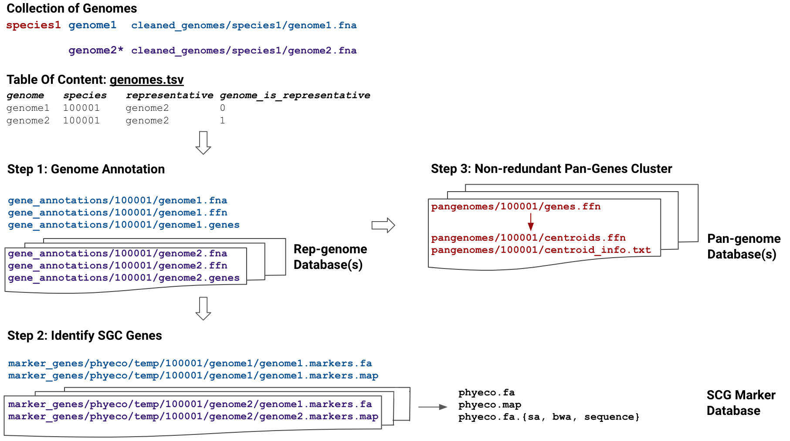

.. _download_midasdb:

Downloading the MIDASDB
=======================

MIDAS Reference Database (MIDASDB) is comprised of three components: representative genomes,
species pangenomes, and marker genes. For each MIDASDB, six-digit numeric species ids are randomly assigned and stored in the corresponding metadata file (``metadata.tsv``).

For MIDAS2, we have already built two
MIDASDBs from large, public, microbial genome databases:

.. code-block:: shell

  midas2 database --list

  uhgg 286997 genomes from 4644 species version 1.0
  gtdb 258405 genomes from 47893 species version r202

For the purposes of this documentation we'll generally assume that we're working
with the prebuilt ``uhgg`` MIDASDB and that the local mirror is in a subdirectory
``my_midasdb_uhgg``.

Automatic database downloading is built into MIDAS2 analysis commands (e.g., ``run_snps`` and ``run_genes``).
Specifically, MIDAS2 will download a fraction of the full
database; this subset is determined by which species are identified to be at high
coverage. 

However, when parallelizing computation across samples
multiple commands might try to download the same database components simultaneously,
a race condition.
This may be problematic.

We therefore suggest that, for large-scale analyses, users pre-download the MIDASDB.

Users should start by downloading the taxonomic marker genes.

.. code-block:: shell

    midas2 database \
        --init \
        --midasdb_name uhgg \
        --midasdb_dir my_midasdb_uhgg

This is everything needed to run :ref:`abundant species detection <species_module>`.

It is possible to download an entire MIDASDB using the following
command:

.. code-block:: shell

  midas2 database \
    --download \
    --midasdb_name uhgg \
    --midasdb_dir my_midasdb_uhgg \
    --species all

This requires a large amount of data transfer and storage: 93 GB for ``MIDASDB-uhgg``
and 539 GB for ``MIDASDB-gtdb``.

.. note::
    The database would be much larger except that files are compressed with
    `LZ4 <http://lz4.github.io/lz4/>`_ to minimize storage requirements.

Alternatively, we strongly recommend that users take a **more customized approach to database
loading**, taking advantage of species-level database
sharding to download and decompress only the necessary portions of a
MIDASDB.

Afterwards, we can collect a list of species present in a list of samples.
Parsing the MIDAS2 :ref:`output files<across_samples_species_profile>` (``midas2_output/merge/species/species_prevalence.tsv``) presents a convenient way to do this.

.. code-block:: shell

  awk '$6 > 1 {print $1}' midas2_output/merge/species/species_prevalence.tsv > all_species_list.tsv

Finally, we can download database components (both reference genomes and pangenome collections) based on these species.

.. code-block:: shell

    midas2 database \
        --download \
        --midasdb_name uhgg \
        --midasdb_dir my_midasdb_uhgg \
        --species_list all_species_list.tsv

..
    TODO: Put the merge_species to species.list instructions here. (Even though
    a manually constructed list of species is simpler, we haven't given readers
    all of the necessary tools to actually USE this minimal list of species for
    downstream modules. Therefore, I think this custom species-subset workflow
    should be on its own page.)

Afterwards, the single-sample parts of the SNV and CNV modules can be run in
parallel and without a potential race condition.

.. note::

    It is also possible for advance users to :ref:`contruct their own MIDASDB
    <build_your_own_database>` from a custom genome collection (e.g. for metagenome
    assembled genomes).

..
    TODO: Link to a page that explains everything users need to use only
    a manually constructed subset of the database.

    If we the following list of species ids (here an example with only two species)
    to a plain text file named `species.list`: ::

    $ echo -e "100078\n102478" > species_list.txt

    we can then run the following to preload all of the data needed for these two species:
