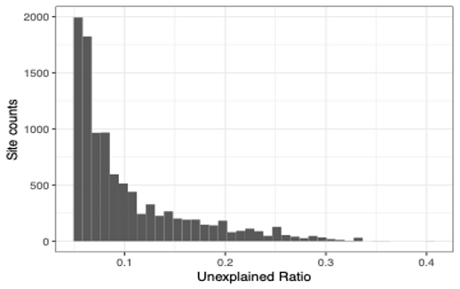
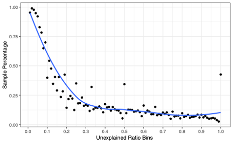
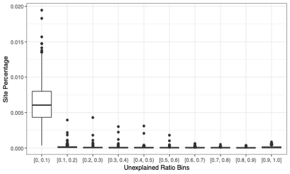

Example Questions
=================

What percent of observed data can be accounted for by the major and minor alleles?
==================================================================================

For a single sample, MIDAS2 reports the read counts for all
four nucleotides (A, C, G, T) for all the genomic sites covered by
more than two reads. For a collection of samples,
MIDAS2 accumulated either the read counts or sample
counts for all four nucleotides and reported the
population major/minor allele, and sample-wise
population major/minor allele frequency.

.. warning::

  MIDAS and MIDAS2 are not a consensus SNP calling tool.

To answer this question, we investigated one of the top prevalent species `Bacteroides_B dorei`
using the PREDICT study. Among the 942 samples metagenotyped by MIDAS2,
354 samples were inferred with a single dominant strain of `Bacteroides_B dorei`,
and 588 samples were inferred with multiple strains.

For all the genomic sites used for the the `quasi-phasable (QP) compute <https://academic.oup.com/view-large/figure/379960629/btac713f1.tif>`_,
we looked at the distribution of the unexplained ratio of two types of
major/minor alleles:

(1) single-sample major/minor allele(s),

(2) population major/minor alleles(s).

.. note::

  It is worth noting that the unexplained ratio of a fixed or bi-allelic site is 0.

Results
-------------

Single-Sample Major/Minor Alleles
*********************************

For genomic sites genotyped with one or two alleles, the single-sample major/minor
allele by definition explained 100% of the read counts.

First, we looked at the percentage of genotyped sites that have more than three alleles:

.. csv-table::
  :align: left

    *Sample Types*,*Average Percentage of Sites with More Than Two Alleles*
    Samples with a dominant strain of B. dorei,0.00609%
    Samples with multiple strains of B. dorei,0.0342%

Second, we investigated the ratio of read counts unexplained by the most
two abundant alleles (single-sample major and minor allele),
for all the 10243 sites (from all 942 samples) genotyped with more than two alleles (`unexplained ratio`).

As shown in the histogram above, 65.25% of the 10243 sites were reported with unexplained ratio less than 10%, and 96.30%  were reported with unexplained ratio less than 25%.

Population Major/Minor Alleles
*********************************

Recall that for each genomic site, the population major allele was voted as the
most prevalent allele based on accumulated sample counts, and population minor allele
was voted as the second most prevalent allele in this analysis. MIDAS2 then reported the
corresponding allele frequency of the population major/minor allele for each sample.

On average 99.3% of the genomic sites can be fully explained by the population
major/minor alleles. We further computed the ratio of read counts unexplained
by the population major/minor alleles for the rest 0.7% sites (per sample).
We binned the unexplained ratio into 100 bins between 0.01 and 1.0.

We first looked at the distribution of the number of samples for the binned unexplained ratio.

We then looked at the percentage of sites for the binned unexplained ratio for all the sites.

**In summary**, the unexplained ratio for most of the sites (not fully explained by the population major/minor alleles) is below 10% (the average per sample site percentage for the (0, 0.1) bin is 0.63%).

What is the detection power of MIDAS2 when multiple strains are present per species?
====================================================================================

We designed a simple simulation experiment to investigate the question:
how often can MIDAS2 detect the minor allele for a sample with two strains?
What is the precision and recall of the genotyping results?

Simulation Design
-----------------
We simulated reads from two NCBI strains of `Phocaeicola-dorei` (MIDASDB UHGG species_id 102478)
with varied sequence depths, shown as following:

.. csv-table::
  :align: left

    *Mixture Strains*,*NCBI Accession*,*NCBI Taxonomy*,*ANI to Rep-genome*,*Simulated Coverage*,*Between-strains ANI*
    Strain1,GCF_000158335.2,Phocaeicola-dorei-5-1-36/D4,98.86%,20X,98.91%
    Strain2,GCF.013009555.1,Phocaeicola-dorei-DSM-17855,98.94%,1X 5X 10X 15X 20X,98.91%

* Rep-genome refers to the default representative genome assigned by UHGG database (GUT_GENOME143505).

Bioinformatics
--------------

We simulated five samples composed of the above mentioned two strains at varying mixing ratios.
MIDAS2 single-sample SNV analysis with the default parameters for reads alignment and post-alignment
filtering were run.
With the single-sample genotyping results, two additional filters were applied: ``site depth >= 5X`` and ``allele frequency >= 0.05``.

Lower sequencing coverage (e.g. 0.1X) really means the horizontal coverage is lower.
However in terms of the vertical coverage for each site,
the above filter required a minimal 5X site depth, and minimal 2X to call an allele (default filter by MIDA2).
Therefore the lowest sequence coverage we simulated here is 1X.

.. warning::

  MIDAS2 doesn’t have the underlying assumption that a sample will have a single dominant strain per species.

Analysis
--------
We determined the correct genotypes for the two mixture strains by using whole-genome
alignments via `nucmer` (true_sites).
Given the high within-species ANI between the two mixture strains,
there are 16603 ALT sites and 4193849 REF sites,
where ALT refers to genomic sites where two strains disagree with each other,
and REF site refers to the site that agrees with each other.
Here the modified population SNVs can be interpreted as genotyping errors in this context.

For each genotyped genomic site, we computed a modified version of population SNVs introduced
by `inStrain <https://www.nature.com/articles/s41587-020-00797-0>`_: a population SNV refers to a site where either the major allele and/or the minor
allele differ from the two strains. Furtheron, we computed the precision and recall of all the genotyped sites:

-	Precision: number of correctly genotyped sites / total number of genotype-able sites
-	Recall: number of correctly genotyped sites / total number of sites in true_sites

Results
-------

.. csv-table::
  :align: left

    *Strain1*,*Strain2*,*Strain Ratio*,*Type*,*Population SNVs*,*Precision*,*Recall*
    20X,1X,0.05,ALT,3,0.003,0.003
    20X,1X,0.05,REF,47,1,0.987
    20X,5X,0.25,ALT,0,0.779,0.758
    20X,5X,0.25,REF,27,1,0.992
    20X,10X,0.5,ALT,0,0.839,0.833
    20X,10X,0.5,REF,22,1,0.993
    20X,15X,0.75,ALT,0,0.855.03,0.851
    20X,15X,0.75,REF,23,1,0.994
    20X,20X,1,ALT,0,0.863,0.859
    20X,20X,1,REF,21,1,0.994

For a sample with a mixture of two strains with average vertical coverage higher than 5X,
both the precision and recall of the genotyped ALT sites increased with the genome vertical
coverage. Since we applied the minimal site depth = 5X filter, most sites for the 1X sample were not detected.

Strain deconvolution is out of scope of MIDAS2, yet the results of the MIDAS2 SNV module
can be used as the input for strain deconvolution tools, such as `StrainFacts <https://www.frontiersin.org/articles/10.3389/fbinf.2022.867386/full>`_.
