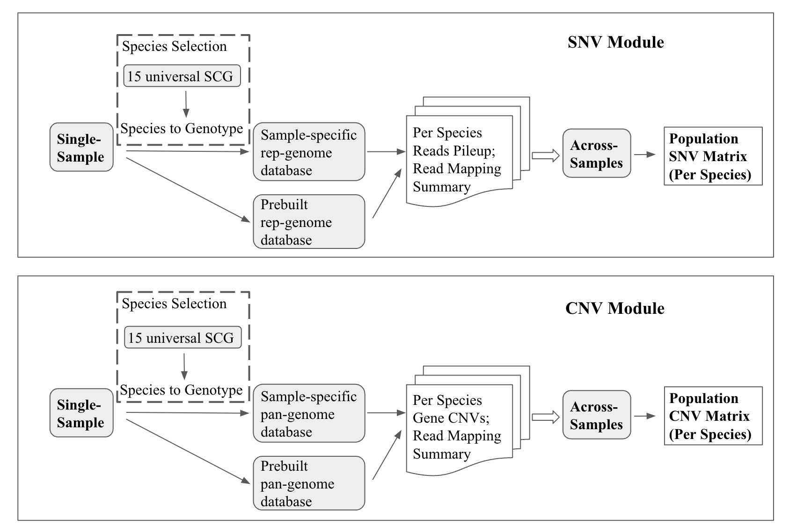

#######################################
MIDAS2 Overview
#######################################

MIDAS2 was developed to address the computational challenges presented by
increasingly large reference genome databases.
MIDAS2 implements the same analyses as the original
`MIDAS tool <https://github.com/snayfach/MIDAS>`_, but re-engineered to

#. host multiple MIDAS Reference Database (MIDAS DB) from public microbial genome collections
#. enable thousands of metagenomic samples to be efficiently genotyped.

MIDAS2 contains two analysis modules focused on:

#. Single nucleotide variants (SNV): :ref:`SNV module <snv_module>`
#. Pan-genome copy number variation (CNV): :ref:`CNV module <cnv_module>`

Each module includes two sequential steps: single-sample analysis and
cross-samples merging.

MIDAS Reference Database
========================

MIDAS2, as any reference-based strain-level genomic variation analysis
pipeline, presupposes a reference database construction step has already
taken place. 
The MIDAS Reference Database (MIDASDB) refers to a set of custom files with
database information needed to run MIDAS2.

The original MIDAS provided a default bacterial reference databases
(see `Figure 1 <https://www.ncbi.nlm.nih.gov/pmc/articles/PMC5088602/>`_):
`MIDAS DB v1.2 <http://lighthouse.ucsf.edu/MIDAS/midas_db_v1.2.tar.gz>`_
was constructed from a collection of 5,952 bacterial species clusters
representing 31,007 high-quality bacterial genomes.

However, in the past few years, the number of sequenced microbial genomes has
increased a lot, in particular with the addition of metagenome-assembled
genomes (MAGs) sequenced from varied habitats.
Therefore, it was necessary to update MIDAS DBs in MIDAS2 accordingly.
On the other hand, processing the large amount of available genome sequences
poses a significant computational challenge.

For MIDAS2, instead of generating the species clusters from scratch, we take
advantage of two published collections of prokaryotic genome databases, and
we build a MIDASDB for each one.

More information about these genome collections can be found in
:doc:`Download MIDASDB <download_midasdb>`.

Command-line Usage
==================

MIDAS2 operates through a command-line interface (CLI).
This interface enables reproducible analyses and allows MIDAS to be
integrated into workflow management frameworks.

.. _common_cli_options:

Common CLI Options
******************

Output Directory
----------------

MIDAS2 writes its outputs to a user-specified root directory,
which is always passed as a mandatory argument to each of the MIDAS2 analyses command.

For example, in :ref:`Quickstart<demo_midas_ourdir>`, ``midas2_output`` is the chosen output directory, and all analyses steps operate within it.

Single-sample Commands
----------------------

The three single-sample commands (``run_species``, ``run_snps`` and ``run_genes``) share a number of command-line flags.

Sample Name
+++++++++++

Users need to chose a unique ``sample_name`` per sample, and together with the output directory,
``midas2_output/sample_name`` constitutes the unique output directory for single-sample analyses.

Input Reads
+++++++++++

The FASTA/FASTQ file containing single-end or paired-ends sequencing reads needs to be passed via the arguments as:

.. code-block:: shell

    -1 /path/to/R1.fastq.gz  -2 /path/to/R2.fastq.gz

Across-samples Commands
-----------------------

A tab-separated sample manifest file listing the ``sample_name`` and full path of the single-sample root output directory
``midas_output`` is required for across-samples analyses.

Users need to pass the path of this file to the command-line argument ``--sample_list``.
For example, in the Quickstart, we passed as following: ``--sample_list list_of_samples.tsv``.

A template is shown here:

.. csv-table::
  :align: left

  *sample_name*,*midas_outdir*
  sample1,/home/ubuntu/MIDAS2.0/tests/midas2_output
  sample2,/home/ubuntu/MIDAS2.0/tests/midas2_output

MIDAS Reference Database
------------------------

For all MIDAS2 analysis, users need to choose

#. a valid precomputed MIDASDB name (uhgg, gtdb) as ``--midasdb_name``
#. a valid local path for the downloaded MIDASDB ``--midasdb_dir``.

For example, in :ref:`QuickStart<example_data>`, we downloaded the SCG marker database for ``--midasdb_name uhgg`` into
``--midasdb_dir my_midasdb_uhgg``.

Others Parameters
-----------------

Users can set the ``--num_cores`` to the number of physical cores to use: e.g. ``--num_cores 16``.

And all MIDAS2 analyses can print out the full help message and exit by ``-h`` or ``--help``.
